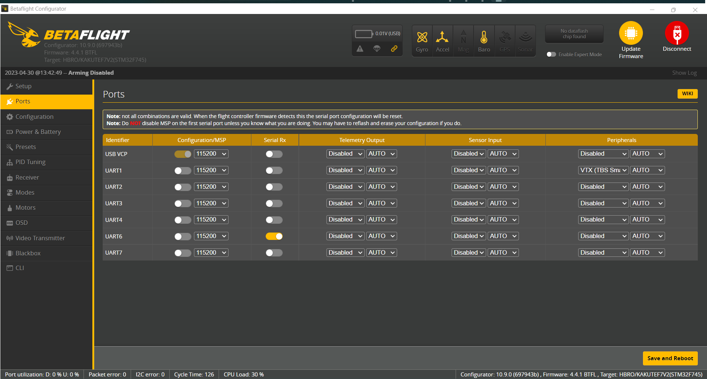
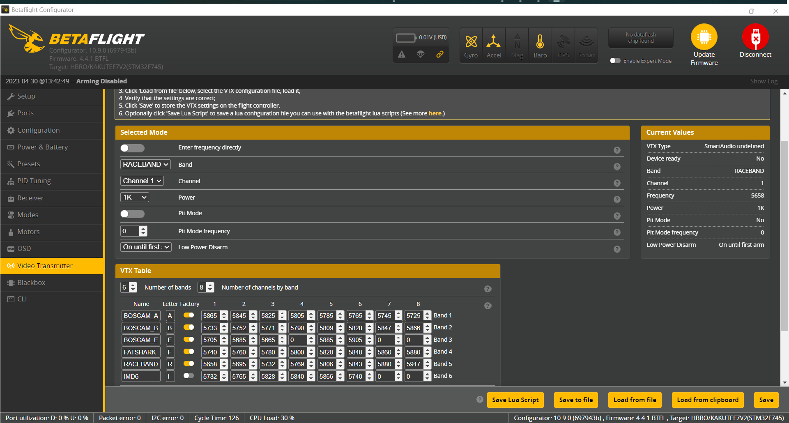

# Instructions on how to setup FPV quad from scratch
## Hardware 
* Holybro kakute F7 v1.5 flight controller ([Datasheet](./Holybro_Kakute_F7_V1.5_Manual.pdf))
* Holybro tekko32 4-in-1 ESC
* iFlight Blitz m10 mini GPS module
* AKK DVR
* Radiomaster R81 receiver

## Flashing firmware
*  Betaflight
  
    1. Download and open betaflight configurator latest version
    2. Put flight controller in DFU mode by pressing the button on flight controller and holding it while you plug the usb in. Make sure to keep holding the button after the usb was plugged in for 2 more seconds.
    3. On the firmware tab select the kakute f7 board and version of betaflight you want.
    4. Press load firmware online and then press flash or whatever the equivalent name is.

*  PX4 or ardupilot

    both Px4 and ardupilot have an error message "no cpu load information" which fails the pre-arm flight check and thus makes it impossible to fly.

## Betaflight Setup
### Configure Ports
Note: All the connections referred here are for Holybro KakuteF7 flight controller. Betaflight version is 4.5.1.

Hardware connections:

  * AKK infintite DVR is connected to **UART1**.
  * Radio receiver (RC) is connected to **UART6**.

In the ports tab of Betaflight configurator:

  * For the UART1 row, select under the peripherals dropdown -> "VTX(TBS SmartAudio)"
  * For the UART6, enable the Serial Rx to allow RC connection.

### Configure Video Transmitter settings
Notes for VTX and AKK DVR: The DVR supports **TBS SmartAudio V2.0** protocol

Follow the setup in [this youtube video.](https://www.youtube.com/watch?v=eaSmoOPk9KY&t=1s)

[Betaflight VTX-Tables github link](https://betaflight.com/docs/wiki/archive/VTX-Tables)
